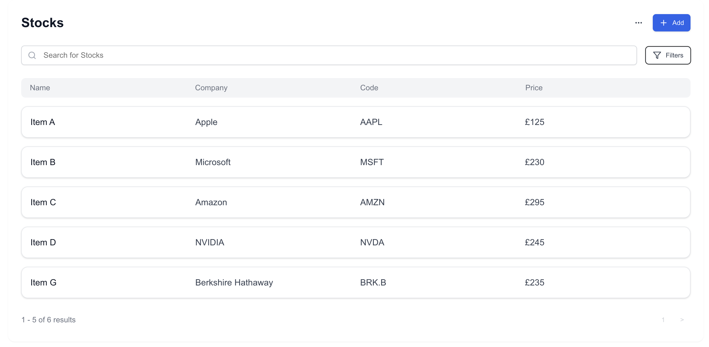

# Space1Test - Stock Monitor Application

## Introduction

The **Space1Test** project is a stock monitoring application built using **Next.js** and **TypeScript**. It provides users with real-time stock market data, allows for monitoring of selected stocks, and offers an intuitive interface for easy navigation. This project showcases core front-end development skills, focusing on data handling, UI design, and performance optimisation.

**Live Link**: [Stock Monitor App](https://stock-monitor-app.vercel.app/)

## Preview



## Solution Overview

The solution integrates data from a third-party API to display real-time stock data in a tabular format. The application allows users to:

- Monitor key stock metrics such as price and volume of stocks.
- Add and remove stocks from their watchlist.
- Sort and filter stock data based on user preferences.
- Change accessibility features for a better experience

This app is designed with scalability and performance in mind, utilising TypeScript for robust type-checking and Next.js for server-side rendering, ensuring fast load times and smooth navigation.

## Approach

The development process followed these key principles:

- **Component-Based Architecture**: The UI is broken down into modular, reusable React components (e.g., `StockTable`, `CardItem`), ensuring that each part of the application can be independently developed, tested, and maintained.
- **API Integration**: The app fetches stock data from an external API using Next.js's server-side capabilities, enabling the display of real-time stock information.
- **State Management**: React's built-in hooks (`useState`, `useEffect`) are used for local state management. Stocks are managed within components, ensuring clean separation of concerns.
- **TypeScript for Type Safety**: TypeScript ensures that the types of the fetched stock data are strictly defined, reducing the risk of runtime errors and improving the overall robustness of the code.
- **SSR for Performance**: Server-side rendering ensures that users can quickly access data as it is pre-rendered on the server, making the initial load faster and SEO-friendly.

## Design Thought Process

- **User-Centric UI**: The interface is designed to be intuitive, with clear buttons for adding and removing stocks, and tables displaying well-organised data for quick analysis.
- **Responsive Design**: The application is fully responsive, providing a consistent experience across devices.
- **Error Handling**: The app gracefully handles API errors and displays appropriate feedback to users in case of network issues or API failures.
- **Optimised Rendering**: By utilising React’s reconciliation and SSR features, the app minimises re-rendering and ensures that only the necessary components are updated.

## Tech Stack

- **Next.js**: For server-side rendering and routing.
- **TypeScript**: For type-safe JavaScript, ensuring more predictable code behaviour.
- **React**: For building modular, reusable UI components.
- **TailwindCSS**: For for styling of reusable UI components
- **CSS Modules**: For component-scoped styling to prevent conflicts.
- **Stock API**: Integration with a third-party stock data API for fetching real-time stock information.
- **Deployment**: The application is deployed on **Vercel**, providing seamless integration with Next.js for optimised performance and scalability.

## Limitations

- **No API or Database**: The stock data used is hard coded, which may affect the accuracy and timeliness of stock data updates.
- **Basic State Management**: Currently, the state management only handles local state within individual components. Introducing a global state management system like Redux could provide better handling of complex data interactions. In addition, create an endpoint would allow for more complex manipulation of data i.e. GET, POST, DELETE etc.
- **No User Authentication**: The app lacks user-specific features like personalised stock lists tied to accounts, which would require backend integration for full functionality.
- **Validation and Edge Cases**: Currently the appliction does not check that data entries conform to specific parameters, so the quality of the data cannot be guaranteed.

## Future Improvements

- **Global State Management**: Implement Redux or Context API for handling global states, such as a stock watchlist that persists across components and sessions.
- **Authentication and User Profiles**: Add user authentication using OAuth or similar methods to allow users to save personalised stock watchlists.
- **Data Caching**: Implement caching strategies to minimise API requests and reduce load times, especially for frequently monitored stocks.
- **Testing**: Given more time the appliction would benefit from more unit tests using **Jest** and integration tests with **React Testing Library** to improve code quality and ensure that edge cases are handled.
- **UI/UX Enhancements**: Improve the stock table's design by adding colour indicators (e.g., red/green for price changes), tooltips, and pagination for large datasets.

## Getting Started

To get started with this project locally, follow the steps below:

1. **Clone the repository:**

   ```bash
   git clone https://github.com/jjrdevspace01/spacetest1
   ```

2. **Install the necessary dependencies:**

   ```bash
   npm install
   ```

3. **Start the development server:**

   ```bash
   npm run dev
   ```

4. Open [http://localhost:3000](http://localhost:3000) in your browser to view the application.

## Running Tests

If applicable, outline your testing setup here. You could say something like:

- **Jest** and **React Testing Library** have been used for unit and integration testing. To run tests, simply run:
  ```bash
  npm test
  ```

## Learn More

To learn more about Next.js and related technologies, take a look at the following resources:

- [Next.js Documentation](https://nextjs.org/docs) - learn about Next.js features and API.
- [TypeScript Documentation](https://www.typescriptlang.org/docs/) - learn about the power of static typing in JavaScript.

## Deployment

The app is deployed on **Vercel** and can be accessed via this [live link](https://stock-monitor-app.vercel.app/). For deploying on Vercel:

1. Connect your GitHub repository to Vercel.
2. Push your code to the `main` branch, and Vercel will automatically deploy your app.
